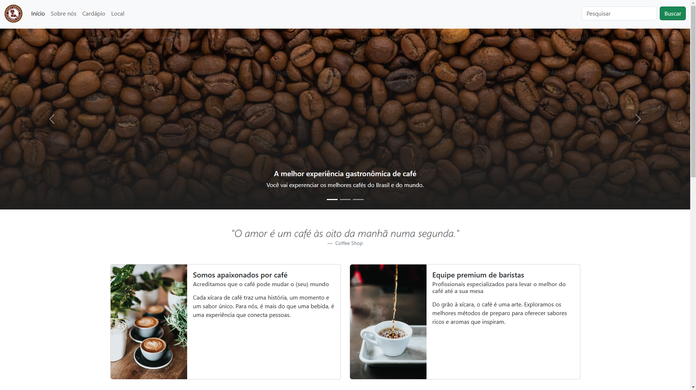

# # Coffee Shop

Este projeto foi desenvolvido como parte das aulas da Trilha de CSS da DIO. O objetivo foi criar um site com a temática de uma cafeteria, utilizando o framework Bootstrap para facilitar a construção de um layout responsivo e moderno.

## Tecnologias Utilizadas

- **HTML5**
- **CSS3**
- **Bootstrap**

